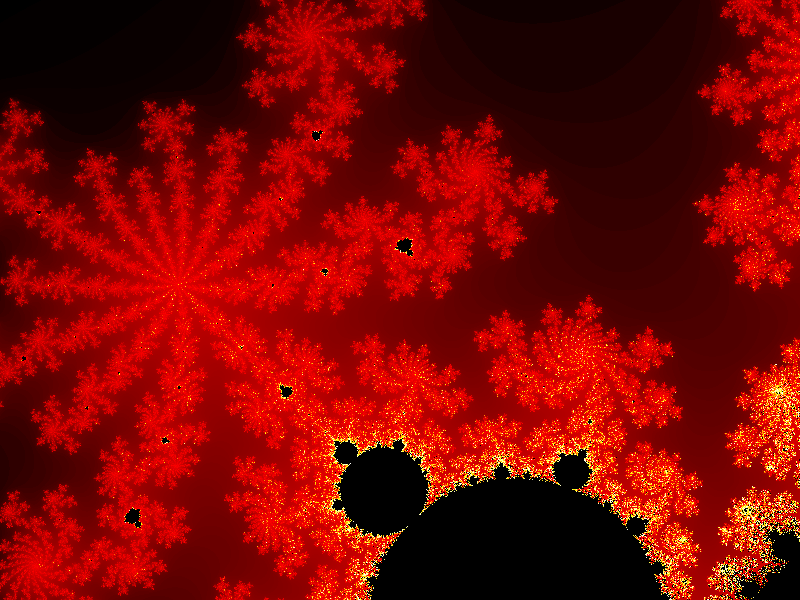

## MandelbrotFractalImage

I have made this program while going through "Learn Advanced C++ Programming" course by John Purcell. 

This program create Mandelbrot Fractal Image using C++. test.bmp contains final fractal image. This is using C++11 features, so the source code should be compiled with C++11 option enabled.

